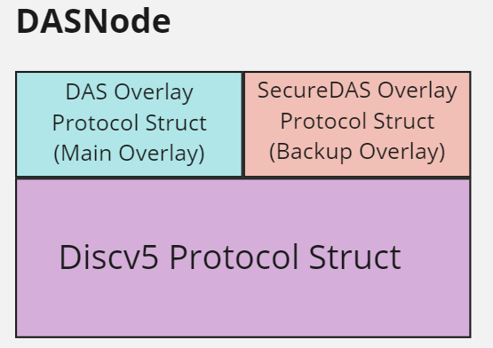

# Motivation
As per Ethereum's [rollup-centric roadmap](https://ethereum-magicians.org/t/a-rollup-centric-ethereum-roadmap/4698), full-scale Danksharding requires extra *blob* data to be [available](https://github.com/ethereum/research/wiki/A-note-on-data-availability-and-erasure-coding) for others to download.  Efficient verification of a blob's availability can be achieved through the process of [data availability sampling](https://hackmd.io/@vbuterin/sharding_proposal#ELI5-data-availability-sampling), allowing the network to come to consensus on this data's availability without increasing the computational resources required for a node.

Between this increase in information (from 90 KB to 128 MB per block!) and our new communication paradigm (data availability sampling), Ethereum's Consensus Layer P2P Network needs an upgrade.

Designs around *how* Ethereum's Consensus Layer P2P Network network can communicate this new information is an open question known as the [Data Availability Sampling Networking problem](https://github.com/ethereum/requests-for-proposals/blob/master/open-rfps/das.md).

# Summary
One possible solution to *part of* the DAS Networking problem is to create a **Secure Kademlia DHT overlay network atop Discv5**, with the goal of facilitating a robust structured network where samples could be efficiently stored and retrieved throughout Ethereum's consensus layer network.  **This S/Kad overlay network would serve as a backup in case the primary network was attacked.**

DAS Playground aims to combine Dankrad's idea of a [Secure Kademlia DHT]((https://notes.ethereum.org/@dankrad/S-Kademlia-DAS)) with the main data struct, [DASNode](https://github.com/ChainSafe/das-prototype/blob/main/src/main.rs#L88), found within Timofey and Eric's discv5 overlay simulation, [DAS Prototype](https://github.com/ChainSafe/das-prototype), to create the networking stack nodes need for a DAS p2p networking design.

&nbsp;

[DAS Playground](https://github.com/EchoAlice/das-playground) and [DAS Prototype](https://github.com/ChainSafe/das-prototype) leverage Trin's [overlay protocol](https://github.com/ethereum/trin/tree/master/trin-core/src/portalnet) + Sigma Prime's [discv5 protocol](https://github.com/sigp/discv5) to support these custom overlay networks.

&nbsp;
# Current Repository Status
DASNodes contain discv5, overlay, and secure overlay protocol structs, services and message processing.  The discv5 protocol [powers these overlay networks](https://notes.ethereum.org/@pipermerriam/B1SS-nhad) via its TalkReq/TalkResp message.  DAS Playground's instance of discv5 seems to be supporting all base protocol [Overlay Network functionality](https://github.com/ethereum/portal-network-specs/blob/796d3c5772e845b98a6191465a695be7f5324b65/implementation-details-overlay.md#portal-network-overlay-network-functionality) needed for overlay routing table maintenance.

**Note:** 
As of right now the overlay and secure overlay protocol structs are functionally the same.  **There is no updated secure kademlia routing table logic that allows for desired secure overlay properties**: our DASNode just has two separate routing tables that can send and receive discv5 TalkReq/TalkResp messages to each individual subnetwork.  I'm beginning work on a secure kademlia library that will (hopefully) integrate in with this repository.

### To Do:
1. Send and receive samples via overlay and secure overlay networks
2. Implement all other [Portal Wire Protocol Message types](https://github.com/ethereum/portal-network-specs/blob/796d3c5772e845b98a6191465a695be7f5324b65/implementation-details-overlay.md#portal-network-overlay-network-functionality):
    - Ping/Pong
    - FindNodes/FoundNodes
    - FindContent/FoundContent
    - Offer/Accept
3. Combine overlay functions' logic
4. Implement concurrent communication
5. Integrate SecureDAS Overlay within [Model DAS](https://github.com/EchoAlice/Model-DAS)
6. Create attacks and fallback network logic